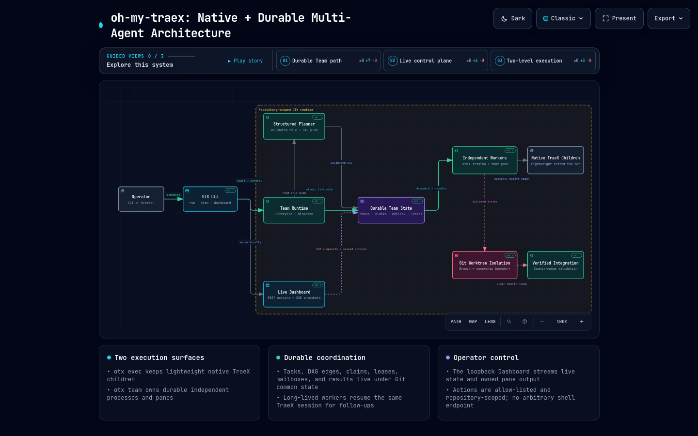

<div align="center">

# oh-my-traex

**为 TraeX 补上真正可观察、可恢复的多 Agent 运行时。**

一套受 `oh-my-codex` 启发的 TraeX 原生编排层：保留轻量原生 children，同时提供独立进程、独立 pane、独立 session、独立 worktree 和持久化任务状态。

[](package.json)
[](https://www.trae.ai/)
[](#开发与验证)
[](LICENSE)

[快速开始](#体验当前版本) · [架构](#系统架构) · [Dashboard](#实时-dashboard) · [命令参考](#命令参考) · [English](README.en.md)

</div>

> **当前状态：** `main` 提供 `otx run` 原生子 Agent 编排和 `otx team` 持久化独立 worker 两条执行路径。Team runtime 已覆盖结构化规划、任务 DAG、claim lease、mailbox、动态扩缩容、安全集成与清理；Web Dashboard 通过本地 REST/SSE 控制面实时展示和操作这些状态。

## 系统架构

<a href="assets/oh-my-traex-architecture.html"></a>

> 架构图由 [Archify](assets/oh-my-traex-architecture.html) 生成。点击图片可打开支持搜索、聚焦、主题切换和导出的交互版本；源规范见 [`docs/oh-my-traex.architecture.json`](docs/oh-my-traex.architecture.json)。

## 体验当前版本

需要 Node.js 22+、Git、tmux，以及 PATH 中可用的 `traex`。

```bash
git clone https://github.com/YiHarvest/oh-my-traex.git
cd oh-my-traex
npm link
otx doctor
```

启动轻量原生 children 编排：

```bash
otx run -n 3 --mode balanced "Review this repository and implement the approved fixes"
```

在 tmux 中启动持久化 Team：

```bash
otx team --workers 3 --name release-team "Implement, test, and review the release"
```

启动仓库级实时控制台：

```bash
otx dashboard -C /path/to/repository --port 4173
# open http://127.0.0.1:4173
```

## 核心想法

TraeX 已经有原生 child agents，但复杂工程任务还需要另一层运行时保证：子任务不能只存在于当前对话上下文里，worker 需要独立窗口和 Git 边界，任务交接需要持久化，崩溃后仍要知道谁拥有什么、做到了哪一步。

oh-my-traex 因此保留两个层次：

1. `otx run` 使用 TraeX 原生 children，适合低成本、同会话的并行探索。
2. `otx team` 启动独立 TraeX 进程；每个一级 worker 拥有自己的 tmux pane、session、branch 和 worktree。
3. Team worker 仍可在内部使用原生 TraeX children，形成“持久一级 worker + 轻量二级子 Agent”的结构。
4. Leader 负责拆分、所有权、验证和最终集成，不把共享分支写权限交给 worker。

## 为什么不只用原生 children？

| 能力 | `otx run` | `otx team` |
|---|---|---|
| 运行单元 | TraeX 原生 child thread | 独立 TraeX 进程与 session |
| 可见性 | TraeX session / 可选 tmux viewer | 每个 worker 独立 tmux pane + Web Dashboard |
| 文件隔离 | 共享工作区，由 prompt 约束 | 独立 Git branch 与 worktree |
| 状态持久化 | 依赖 TraeX session | `.git/otx/team/<team>/` |
| 后续任务 | 新 child 或当前会话协调 | 原 session mailbox resume |
| 依赖编排 | Leader prompt | 持久化 DAG、claim 和 lease |
| 恢复与诊断 | TraeX 原生能力 | pane、PID、heartbeat、activity、task、mailbox、Git 状态 |
| 最适合 | 探索、评审、小型并行任务 | 长任务、并行实现、可恢复交付 |

两者不是替代关系。`otx run` 保持轻，`otx team` 提供 `oh-my-codex` 风格的耐久编排。

## 实时 Dashboard

Dashboard 是 Team runtime 的本地控制面，而不是模拟器或任意命令终端。它只监听 `127.0.0.1`，绑定一个明确的 Git 仓库，并提供受限动作：

- 通过 SSE 实时更新 Team、Task、worker、heartbeat、activity、mailbox 和终端输出；
- 按 Team 分组浏览任务，点击 worker 即切换对应 pane 的输出；
- 发送同 session follow-up，或创建带 `depends_on` 的持久化任务；
- 动态增加独立 worker，并明确选择 role 与 assignment；
- 根据 runtime 状态启用或禁用操作；
- 停止 Team 前展示受影响 worker 和未完成任务，并要求二次确认；
- 将“进程仍活着但 TraeX 长时间无事件”显示为 `stalled`，避免假健康；
- 支持 `J/K` 切换任务、`[/]` 切换 worker、`1/2` 切换 inspector、`M` 发消息、`A` 分配任务、`?` 查看快捷键。

Dashboard 不提供任意 shell API。停止操作只会在 leader pane 反查确实属于 `otx-web-<team>` 后清理对应 tmux session。

## 当前源码提供什么

| 已交付能力 | 验证证据 |
|---|---|
| 原生 child orchestration | 有界 fan-out、角色约束、leader 集成 contract 测试 |
| 独立 Team workers | 真实 tmux pane、TraeX session、branch 和 worktree E2E |
| 结构化规划 | JSON schema、role、路径、DAG cycle 和写入所有权验证 |
| 持久化任务协调 | 原子 task records、跨进程 claim、lease 续租/回收、依赖解锁测试 |
| 长驻 mailbox | 同 session follow-up、显式任务派发和结果路径验证 |
| 动态成员 | worker index 单调递增、安全 add/remove E2E |
| 安全集成和清理 | commit range 校验、cherry-pick、pane ownership 与 dirty-worktree 防护 |
| Live Dashboard | REST/SSE、真实 pane capture、状态动作、桌面/移动响应式验证 |
| 健康诊断 | heartbeat、pane liveness、activity age 和 `stalled` 状态 |

## Team 如何工作

启动时，Team 先确认 leader checkout 干净，再执行以下流程：

1. 结构化 planner 生成 worker roles、assignment、文件边界和 DAG；显式 `N:role` 或 `--no-plan` 可跳过规划。
2. Runtime 为每个一级 worker 创建 branch、Git worktree、tmux pane 和 TraeX session。
3. 状态写入 Git common directory 下的 `.git/otx/team/<team>/`，所有 worktree 可见但不会污染工作区。
4. Worker 在依赖完成后 claim task，并通过 heartbeat 续租；过期 lease 可被安全回收。
5. Leader 通过 mailbox 发送普通 follow-up，或创建新的持久化任务。
6. 写入型 worker 必须产生干净 commit；leader 验证 commit range 后再选择集成。
7. Stop 和 cleanup 在操作 pane、branch 或 worktree 前重新验证所有权与可恢复状态。

状态目录示例：

```text
.git/otx/team/release-team/
├── config.json
├── tasks/
│   ├── task-1.json
│   └── task-2.json
├── mailbox/
│   └── worker-1/
└── workers/
    ├── worker-1.json
    └── worker-1/
        ├── prompt.md
        ├── result.md
        └── followup-<message-id>.md
```

## 命令参考

| 命令 | 用途 |
|---|---|
| `otx run <task>` | 启动使用原生 children 的 TraeX leader |
| `otx run --ui dashboard <task>` | 启动 TraeX app-server/session viewer 组合 |
| `otx prompt <task>` | 输出 leader orchestration prompt |
| `otx team [N:role] <task>` | 启动独立持久化 Team workers |
| `otx team [N:role] --headless <task>` | 使用无 UI 的进程 backend 启动 Team，适用于 CI/容器 |
| `otx team list` | 列出当前仓库的 Team |
| `otx team status <name>` | 查看 worker、pane、worktree、commit 和结果 |
| `otx team reconcile <name>` | 将失联 worker 和 Team 终态显式同步到持久化状态 |
| `otx team recover <name>` | 恢复启动或成员变更中断后遗留的 pane、worktree 和状态 |
| `otx team supervise <name> [--once]` | 运行自愈控制循环，回收过期 lease、恢复事务并同步 Team 状态 |
| `otx team events <name> [--after CURSOR] [--limit N]` | 增量读取按序持久化的 Team 事件 |
| `otx team prune <name> [--older-than 30d] [--keep-events N]` | 将过期事件和终态事务归档，并保留最近事件 |
| `otx team await <name>` | 等待所有 worker 进入终态 |
| `otx team send <name> <worker> <message>` | 向原 worker session 投递 follow-up |
| `otx team assign <name> <worker> [--depends-on IDs] <task>` | 创建并派发持久化任务 |
| `otx team add-worker <name> <role> <assignment>` | 动态增加独立 worker |
| `otx team remove-worker <name> <worker>` | 安全移除空闲且可回收的 worker |
| `otx team diagnose <name>` | 查看 pane、PID、heartbeat、activity 和阻塞信息 |
| `otx team doctor <name> [--repair]` | 校验/迁移状态 schema，并隔离损坏的辅助记录 |
| `otx team metrics <name> --json` | 输出队列、worker、lease、重调度、恢复和延迟指标 |
| `otx team integrate <name> [workers...]` | 验证并 cherry-pick worker commit range |
| `otx team stop <name>` | 验证 pane ownership 后停止 Team |
| `otx team cleanup <name>` | 清理已停止且安全的 branch/worktree |
| `otx dashboard [-C repo]` | 启动仓库级 Live Team Dashboard |
| `otx doctor` | 检查 Node、TraeX、Git、tmux 和 multi-agent feature |

Mailbox 投递使用一次性 receipt token，避免并发 worker 重复消费同一消息。`reconcile` 会将失败 worker 的任务最多自动重调度一次，优先选择同角色且写入要求一致的健康 worker；投递、完成与重调度均写入可增量读取的原子事件记录。

## 安全边界

- worker 与 leader 显式使用 TraeX `permission-mode=default` + `workspace-write`；planner 使用 `permission-mode=default` + `read-only`；follow-up resume 也显式保持 `permission-mode=default`，不会继承为 bypass-permissions。
- Dashboard 只绑定 loopback，不开放任意 shell endpoint。
- Worktree 信任仅通过 worker 进程级配置覆盖，不写入用户全局信任列表。
- 所有 pane kill 都校验 team、worker、run ID 与原始 pane PID。
- dirty 或未集成 worktree 不会被 cleanup 静默删除。
- DAG claim 使用跨进程锁和 token；过期或错误 token 不能完成任务。

## 开发与验证

Release workflow 使用 npm Trusted Publishing（OIDC），不依赖长期 `NPM_TOKEN`。首次发布前，需在 npm package settings 中把本仓库的 `.github/workflows/release.yml` 配置为 trusted publisher。

```bash
npm test
npm run test:coverage
npm run test:stress
npm run test:e2e:packed
npm run pack:check
npm run doctor
npm pack --dry-run
node src/cli.js run --dry-run -n 2 "Inspect this repository and propose improvements"
```

CI 在 Linux、macOS、Windows（Node.js 22）以及 Linux Node.js 24 上运行单元测试；Linux 另跑覆盖率、64 进程压力测试、打包校验和 packed runtime E2E。

## 许可证

[MIT](LICENSE) © 2026-present [YiHarvest](https://github.com/YiHarvest)
